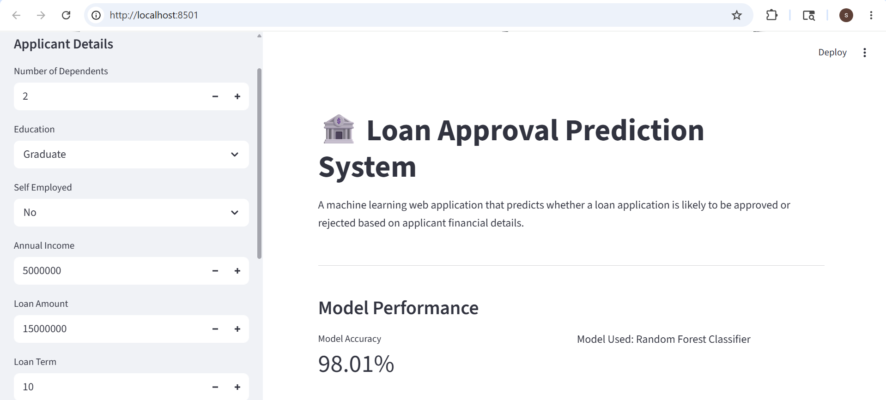
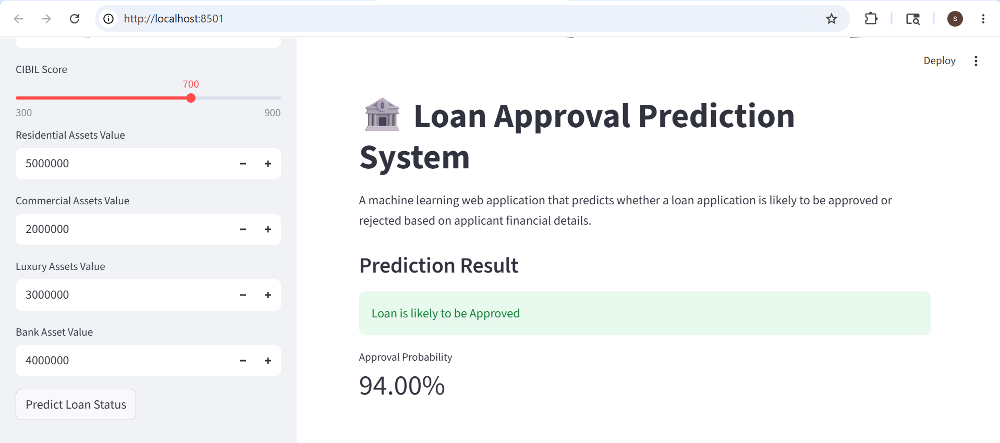

# 🏦 Loan Approval Prediction System

A machine learning web application that predicts whether a loan application is likely to be approved or rejected based on applicant financial details.

Built using Random Forest, SMOTE, Scikit-learn, and Streamlit.

---

## 📸 Application Preview

### Streamlit Dashboard



---

### Loan Prediction Result



---

## 🚀 Features

- Predicts loan approval status using machine learning
- Interactive Streamlit dashboard
- Handles imbalanced datasets using SMOTE
- Feature scaling and preprocessing pipeline
- Real-time prediction generation
- Model performance visualization
- Confusion matrix and classification report

---

## 🛠️ Tech Stack

- Python
- Scikit-learn
- Random Forest Classifier
- Streamlit
- Pandas
- NumPy
- Matplotlib
- SMOTE (imbalanced-learn)

---

## 📂 Project Structure

```bash
loan-approval-prediction-system/
├── README.md
├── requirements.txt
├── .gitignore
├── app.py
├── data/
│   └── loan_approval_dataset.csv
├── assets/
│   ├── app-ui.png
│   └── prediction-result.png
└── src/
    ├── __init__.py
    ├── data_preprocessing.py
    ├── model_training.py
    ├── prediction.py
    └── visualization.py

---

## ▶️ Installation

Clone the repository:

```bash
git clone https://github.com/ShaiveSharma02/loan-approval-prediction-system.git
cd loan-approval-prediction-system
```

Install dependencies:

```bash
pip install -r requirements.txt
```

---

## ▶️ Run Application

```bash
python -m streamlit run app.py
```

---

## 📊 Machine Learning Workflow

1. Load and preprocess dataset
2. Handle missing values
3. Apply feature scaling
4. Balance dataset using SMOTE
5. Train Random Forest Classifier
6. Evaluate model performance
7. Generate real-time predictions

---

## 📈 Model Performance

- Random Forest Classifier
- SMOTE balancing for class imbalance
- Confusion Matrix visualization
- Classification Report generation
- Real-time probability scoring

---

## ⚠️ Disclaimer

This project is intended for educational and portfolio purposes only.

Predictions should not be used for real-world financial decision-making.

---

## 👨‍💻 Author

Shaive Sharma
